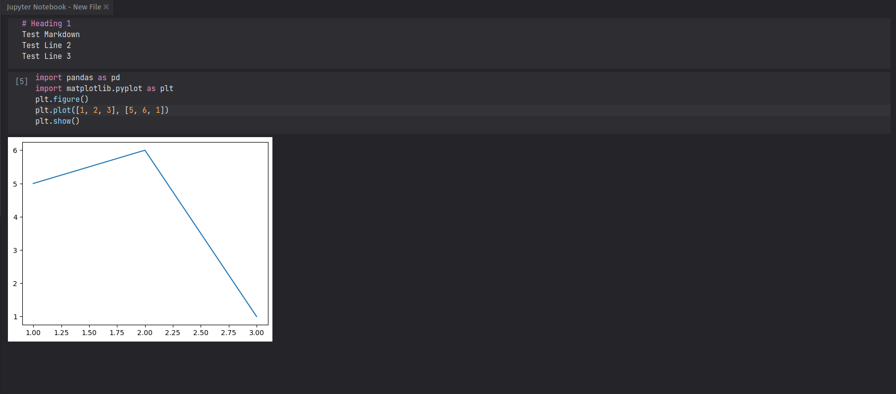

# Jupyter Notebooks for Lite XL

Adds support for Jupyter Notebooks in Lite XL.

A thin wrapper over a small python kernel.

Requires the new canvas API in Lite XL 3.0.



### TODO

1. Allow for inline formulas, as opposed to only multi-line formulas in Markdown cells.

### Preview

```
lpm run https://github.com/adamharrison/lite-xl:3.0-preview --update https://github.com/adamharrison/jupyter:master 3.0-preview jupyter
```

1. `Jupyter: New Notebook` 
2. `Jupyter: Add Markdown Block` 
3. `Jupyter: Add Code Block` 
4. Type things.
5. `F8`

